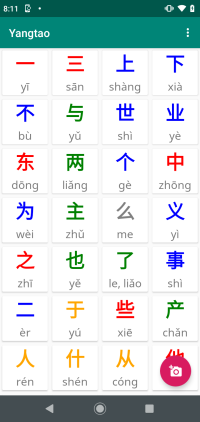
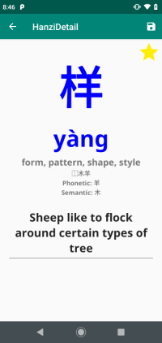
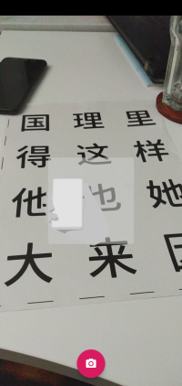
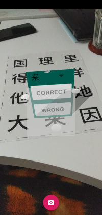
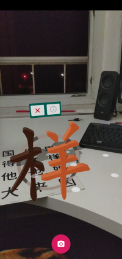

# Yangtao

*yáng táo* (杨桃) is an augmented reality app for learning Chinese characters. It was developed for the [2019 International Collegiate Competition for Brain-inspired Computing（ICCBC 2019](https://contest.cbicr.org/en/index.php?catid=1). We were ranked in the top 16 and participated in the finals in Tsinghua University, Beijing, China. The idea is to combine many different cues to better remember Hanzi, e.g. etymology, radicals, pronounciation, mnemonics, ...

## Screenshots

<figure class="image" width="200">
  
  <figcaption>The collection shows characters that can be scanned or already scanned (marked by a star)</figcaption>
</figure>

<figure class="image" width="200">
  
  <figcaption>The detail view shows information regarding pronuncia#on, meaning, decompositon, etymology and user-defined mnemonic.</figcaption>
</figure>

<figure class="image">
  
  <figcaption>In the AR view, characters can be scanned so that they appear in 3D.</figcaption>
</figure>

<figure class="image">
  
  <figcaption>After scanning a character, the user has the choices to either accept it as correct, wrong, or choose one of the 10 predictions instead.</figcaption>
</figure>

<figure class="image">
  
  <figcaption>The augmented reality view allows users to scan and then explore characters in 3D. Clicking on the info sign leads the user to the details view.</figcaption>
</figure>

## Motivation

Chinese characters are an essential part of the Chinese language and culture. They are an integral part of becoming proficient in Mandarin. Learning even only the most common 2000-3000 characters is an arduous task that requires many hours of study. To support students, we implemented an augmented reality smart phone app for interacting with Chinese characters. 
When pointing the smart phone camera to a single character, we identify the character with machine learning and show its 3D representation above it. Its etymology, decomposition and mnemonic can be looked up. We use the knowledge about how the brain works and learns so that our users can better and more efficiently remember all the Hanzi. This is done by e.g. teaching character decompositions **六書**, showing the decomposition in the 3D view or helping users coming up with mnemonics to connect Hanzi parts to a story.

The learning process implemented in Yangtao relies on the Dual Coding Theory of Reading and Writing which states that the brain best remembers if the item to remember, in this case Hanzi, is associated with as many different cues as possible. Therefore, we present the users with visual cues (the 3D Hanzi), audio cues (the pronunciation) and the logic behind the Hanzi (its decomposition, etymology and kind of formation).

A mnemonic for **休** could be e.g. a man leaning on a tree to rest, which is arguably easier to remember than learning its meaning by rote. The first app prototype is available for Android and uses Google ARCore, Sceneform and tflite. The character recognition itself uses a feed-forward neural network that is fed with HOG (Histogram of oriented gradients) features from filtered camera images. 

Our prototype supports 250 selected characters. In the next iteration, we want to add online learning/lifelong learning capabilities so that the character recognition is  improved by user feedback if it was wrong, adapting the app to the users’ environment. This is similar to how the brain continually learns and adjusts.

## App usage

The app has three screens. When opening, it starts in the collection screen where all included 
Hanzi can be viewed. Clicking on a Hanzi opens its detail screen, showing information about 
meaning, mnemonic, decomposition and more. The mnemonic can be changed and saved with the 
buttin in the top right corner.

From the main screen, when clicking on the camera+ button in the bottom left, the AR view
can be openend. At first, planes have to be detected, e.g. a table top. For this, the phone
needs to be moved around left and right until plane indicator in form of dots appear. Then
you are ready to scan Hanzi. The character should be aligned to the focus in the middle of the
screen and scanned from the top. When pressing the scanning button, it then opens a menu.
If the character is correct, it can be directly accepted. If it can be found in the dropdown
list, it can be selected and then accepted. After accepting, the hanzi in 3D appears. One can
move around and investigate its composition and shape as if it was a real object. It can be 
removed by clicking on the X or one can switch to the details view by clicking on the (i).

If it was totally wrong, then it needs to be scanned again. Typical problems we encountered are 
shadows, noisy background or only partially capturing the Hanzi. In the main view, the settings
menue in the top right can be used to activate the debug view. It shows more information during
scanning about how the app processes the image.

